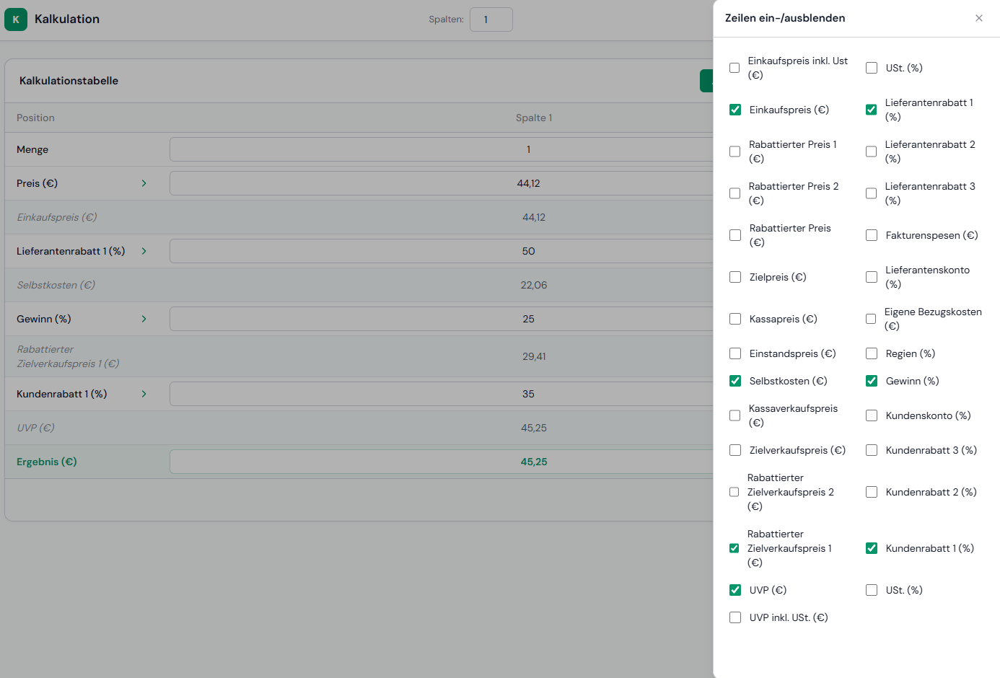
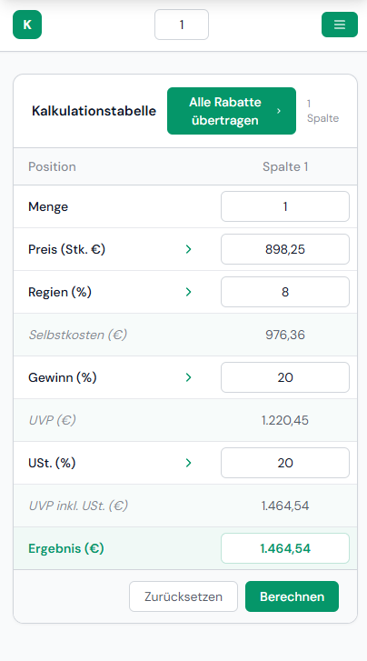

# Trade Calculation App

> A multi-column pricing chain calculator based on the Austrian commercial calculation schema — computes costs, margins, and selling prices across up to 20 product variants simultaneously.


| Configuration Drawer | Mobile View |
|---|---|
|  |  |

🔗 **Live Demo:** [PLACEHOLDER - I will add this later]

---

## Features

- **Full pricing chain:** From gross purchase price through supplier discounts, overhead, and profit margin to final RRP with VAT
- **Multi-variant comparison:** Calculate up to 20 product variants side-by-side in a single table
- **One-click spread:** Copy any field value from the first column to all other columns instantly
- **Configurable row visibility:** Show or hide any of the 32 calculation rows via a side drawer — preferences are persisted in localStorage

## Tech Stack

**Frontend:** Vanilla JavaScript (ES6 modules), HTML5, Tailwind CSS v4  
**Backend:** None — fully client-side  
**Storage:** localStorage (inputs + row visibility)  
**Deployment:** Static file — no build server required

## Architecture Highlights

The entire table structure is driven by a single `ROW_CONFIG` array in `config.js`, which defines labels, input types, readonly state, and spreadability for all 32 rows. This makes the UI and calculation logic co-located by design. State is managed without any library: form inputs auto-save to localStorage on change, and calculations run on form submission, producing an in-memory `results` object. The responsive drawer (top sheet on mobile, side panel on desktop) uses only CSS transforms with no JS animation library.

## Local Setup

```bash
git clone https://github.com/philippreischer/cost-calculator.git
cd cost-calculator
npm install
npm run watch   # rebuilds Tailwind CSS on changes
```

Then serve the project with any static server (required for ES6 modules):

```bash
npx serve .
```

For a one-time build without watching:

```bash
npm run build
```

## Background

Built as a real-world tool inspired by my day job in technical sales at an electrical systems company. The traditional approach uses static Excel sheets — this app brings the Austrian commercial calculation schema (Handelskalkulationsschema) into a configurable, persistent web tool. It started as a personal Tailwind CSS learning project and grew into a working prototype I plan to validate with potential users.

## Status

Feature-complete for core pricing chain functionality. Row visibility and multi-column support are implemented and stable.

---

**Author:** Philipp Reischer · [Portfolio](https://philippreischer.github.io)